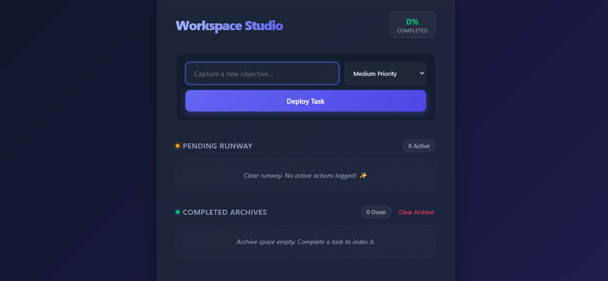
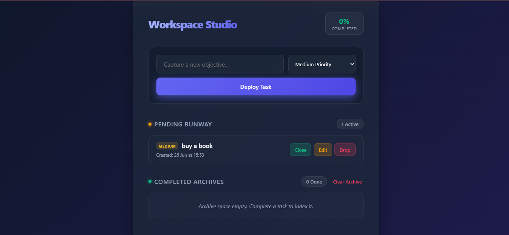
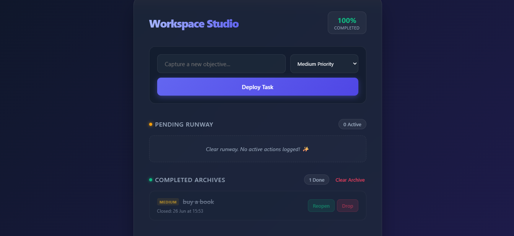

# 📝 To-Do Web App

A modern and interactive **To-Do Web Application** built using **HTML5, CSS3, and Vanilla JavaScript**. The application helps users efficiently organize daily tasks with features such as adding, editing, completing, and deleting tasks. It also provides task counters, timestamps, persistent storage using **localStorage**, and separate Pending and Completed task lists.

Developed as part of the **Oasis Infobyte Web Development & Design Internship – Level 2 (Task 3)**.

---

# 📌 Objective

Develop an interactive to-do list application that enables users to manage their daily tasks with a clean, responsive, and user-friendly interface.

---

# ✨ Features

* ➕ Add New Tasks
* 📋 Separate Pending and Completed Task Lists
* ✅ Mark Tasks as Complete
* ✏️ Edit Existing Tasks
* 🗑️ Delete Tasks
* 📊 Live Task Counters
* 🕒 Timestamp for Added and Completed Tasks
* 💾 Data Persistence using LocalStorage
* 📱 Fully Responsive Design
* 🎨 Modern User Interface
* 📭 Friendly Empty-State Messages

---

# ✅ Feature Checklist

| Requirement                  | Status |
| ---------------------------- | :----: |
| Add Task                     |    ✅   |
| Pending Tasks List           |    ✅   |
| Mark Complete                |    ✅   |
| Completed Tasks List         |    ✅   |
| Edit Task                    |    ✅   |
| Delete Task                  |    ✅   |
| Pending & Completed Counters |    ✅   |
| Task Timestamps              |    ✅   |
| LocalStorage Persistence     |    ✅   |
| Empty-State Messaging        |    ✅   |

---

# 🛠️ Technologies Used

* HTML5
* CSS3
* JavaScript (ES6)
* LocalStorage
* DOM Manipulation

---

# 📂 Project Structure

```text
WebDev-L2-ToDoWebApp/
│
├── index.html
├── style.css
├── app.js
└── README.md
```

---

# 🚀 How to Run

1. Clone or download this repository.
2. Open the project folder.
3. Launch **index.html** in your browser.
4. Start adding your daily tasks.
5. Edit, complete, or delete tasks as needed.
6. Refresh the page—your tasks remain saved automatically using LocalStorage.

No installation or backend server is required.

---

# ⚙️ How It Works

### ➕ Add Task

* Enter a task in the input field.
* Click the **Add Task** button.
* The task instantly appears in the Pending Tasks list.

### ✏️ Edit Task

* Click the **Edit** button.
* Modify the task directly.
* Save the updated task.

### ✅ Complete Task

* Click **Mark Complete**.
* The task moves from the Pending list to the Completed list.
* Completion timestamp is recorded.

### 🗑️ Delete Task

* Remove any task permanently from either list.

### 💾 Automatic Saving

* Every change is automatically stored in LocalStorage.
* Tasks remain available even after refreshing or reopening the browser.

---

# 📚 Learning Outcomes

This project helped me understand:

* DOM Manipulation
* Event Handling
* CRUD Operations (Create, Read, Update, Delete)
* LocalStorage for Data Persistence
* Dynamic UI Updates
* JavaScript Arrays and Objects
* Responsive Web Design
* User Interface Design Principles

---

# 📸 Preview

Add screenshots of your application below.

### Home Screen



### Pending Tasks



### Completed Tasks



> Replace the image paths with screenshots of your own application.

---

# 👨‍💻 Author

**Vismaya UVP**

Developed for the **Oasis Infobyte Web Development & Design Internship – Level 2 Task 3**.
